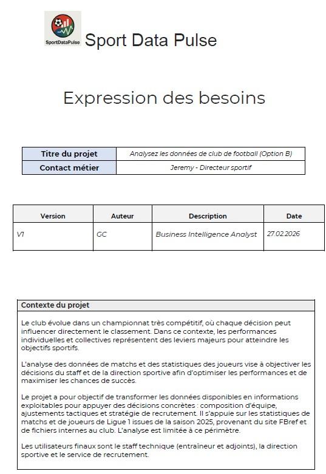
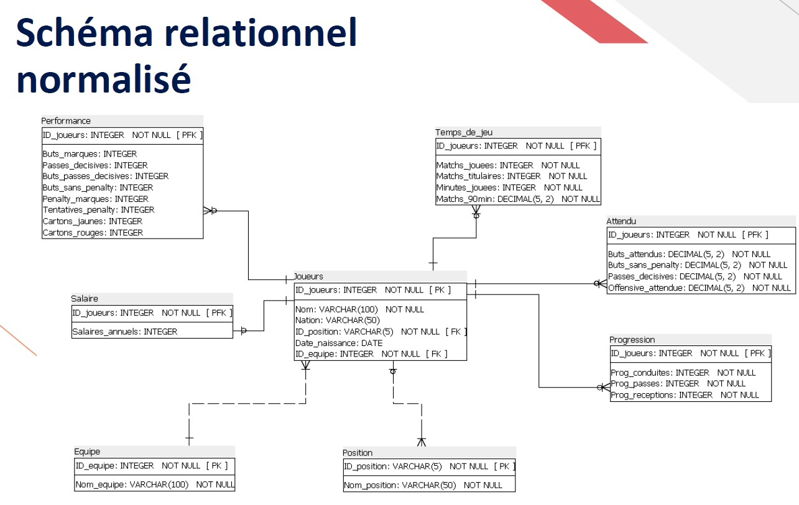
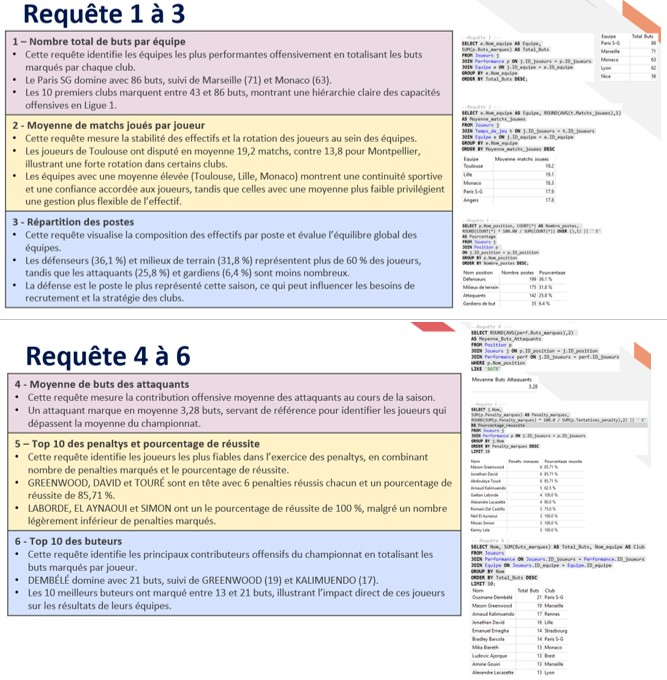
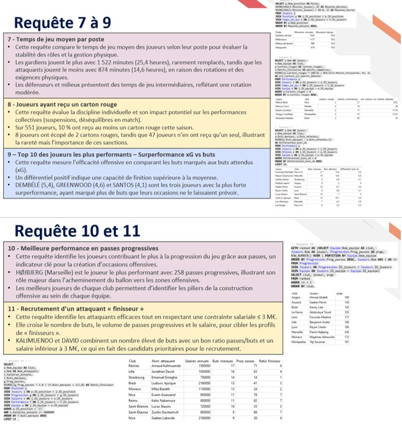
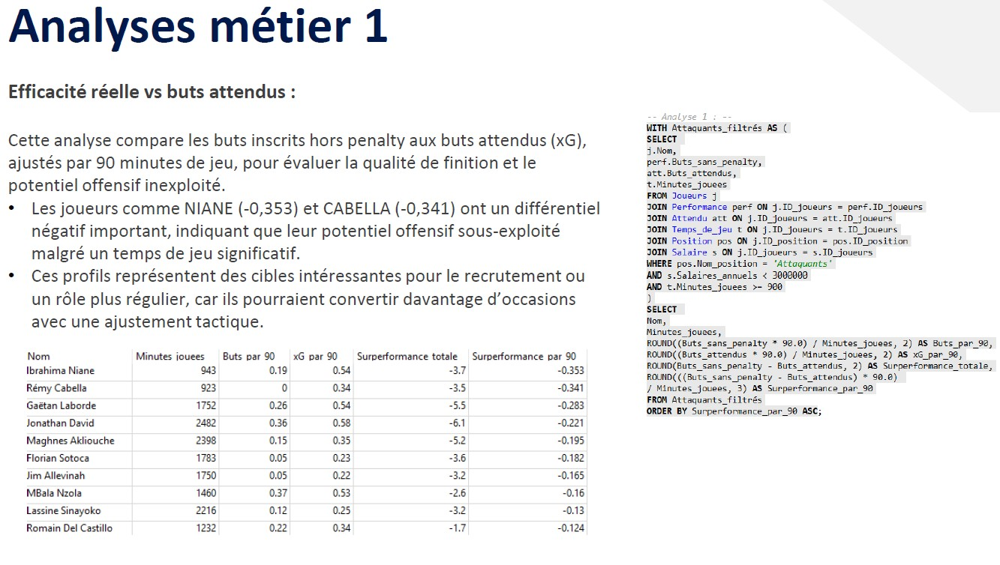
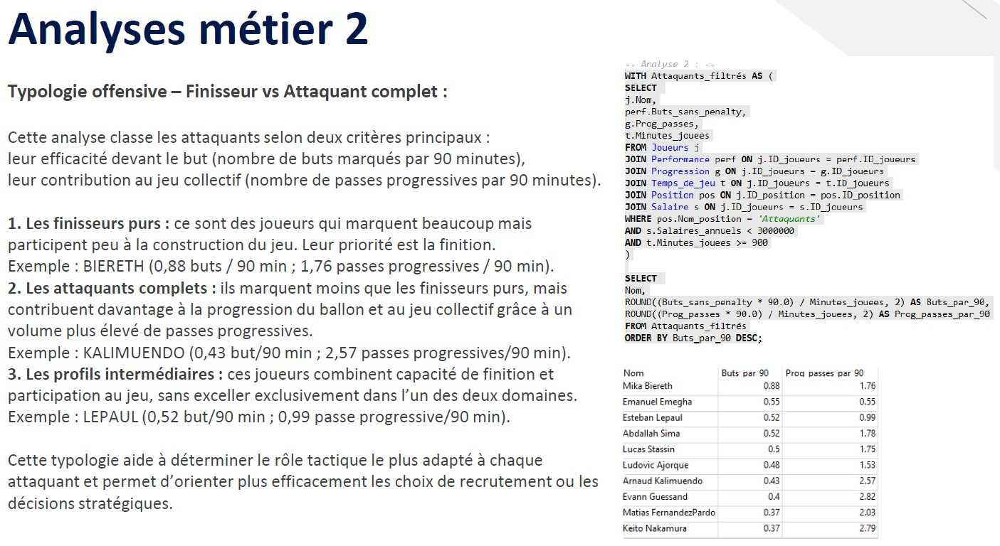

# ⚽ Football Analytics SQL - Analyse des performances des joueurs de Ligue 1

## Contexte

Projet réalisé dans le cadre de la formation Business Intelligence Analyst (OpenClassrooms).

Dans un championnat où les écarts de performance sont faibles, la capacité à exploiter les données devient un avantage compétitif majeur.

Le club fictif SportDataPulse souhaite intégrer davantage la data dans sa stratégie sportive afin d'objectiver les décisions liées à la performance des joueurs, au temps de jeu et au recrutement.

L'objectif de cette mission était de structurer des données issues de la Ligue 1, de construire une base de données relationnelle et de produire des analyses permettant d'accompagner les décisions du staff sportif.

---

## Contenu du dépôt

### Documentation

- Expression_Besoin.pdf

### Visuels

- Expression du besoin
- Schéma relationnel
- Requêtes SQL (partie 1)
- Requêtes SQL (partie 2)
- Analyse xG
- Typologie des attaquants

---

## Livrables

* Base de données relationnelle normalisée
* Requêtes SQL d'analyse
* Analyses métier
* Recommandations sportives
* Documentation du besoin métier

---

## Problématique

Comment exploiter les données de performance de Ligue 1 afin d'identifier les joueurs les plus performants, détecter des opportunités de recrutement et fournir un support chiffré aux décisions sportives ?

---

## Besoin métier

Le document complet d'expression des besoins est disponible dans le dossier **documentation** du projet.

---

## Compétences mobilisées

* SQL
* Modélisation relationnelle
* Conception de base de données
* Analyse métier
* Data Storytelling
* Recommandations stratégiques
* Aide à la décision

---

## Technologies utilisées

* SQLite Studio
* SQL
* Excel
* PowerPoint

---

## Données utilisées

Les données proviennent de statistiques publiques de Ligue 1 et couvrent :

### Données joueurs

* Identité
* Âge
* Poste
* Salaire
* Temps de jeu
* Buts marqués
* xG (Expected Goals)
* Penalties
* Discipline

### Données équipes

* Clubs
* Buts marqués
* Répartition des effectifs

### Indicateurs avancés

* Buts par 90 minutes
* Passes progressives par 90 minutes
* xG
* Réussite aux penalties

---

## Modélisation de la base

### Schéma relationnel

Les données ont été organisées autour de plusieurs entités principales :

* Joueurs
* Équipes
* Performances
* Temps de jeu
* Progression
* Salaires
* Attendus (xG)

La normalisation permet :

* d'éviter les redondances ;
* d'assurer la cohérence des données ;
* de faciliter les analyses croisées via les jointures SQL.

---

## Requêtes SQL réalisées

### Analyse du championnat

Les premières requêtes permettent notamment :

* d'identifier les équipes les plus performantes offensivement ;
* d'analyser la stabilité des effectifs ;
* d'étudier la répartition des postes ;
* d'identifier les meilleurs buteurs ;
* d'évaluer la réussite sur penalty.

### Analyse avancée des performances

Les requêtes avancées permettent :

* d'analyser le temps de jeu moyen par poste ;
* d'évaluer la discipline des joueurs ;
* de mesurer la surperformance ou sous-performance par rapport au xG ;
* d'identifier les meilleurs créateurs de jeu ;
* de construire une short-list de recrutement.

---

## Principaux résultats

### Performance offensive des équipes

* Paris Saint-Germain : 86 buts
* Marseille : 71 buts
* Monaco : 63 buts

### Meilleurs buteurs

* Ousmane Dembélé : 21 buts
* Mason Greenwood : 19 buts
* Arnaud Kalimuendo : 17 buts

### Discipline

* 10 % des joueurs ont reçu au moins un carton rouge.

### Construction du jeu

* Pierre-Emile Højbjerg est le joueur ayant réalisé le plus de passes progressives avec 258 passes.

---

## Analyse métier n°1 : efficacité réelle vs buts attendus

Cette analyse compare les buts inscrits hors penalty aux buts attendus (xG), ajustés par 90 minutes de jeu.

### Objectif

Identifier les joueurs dont le potentiel offensif est sous-exploité.

### Résultat

Des joueurs comme Niane ou Cabella présentent un différentiel négatif important entre leurs buts marqués et leurs buts attendus.

Ces profils peuvent représenter des opportunités intéressantes de recrutement ou bénéficier d'un ajustement tactique permettant de mieux exploiter leur potentiel offensif.

---

## Analyse métier n°2 : typologie des attaquants

Les attaquants ont été classés selon deux critères :

* leur efficacité offensive (buts par 90 minutes) ;
* leur contribution au jeu collectif (passes progressives par 90 minutes).

### Finisseurs purs

Joueurs très performants devant le but mais participant peu à la construction du jeu.

Exemple : Biereth

### Attaquants complets

Joueurs combinant efficacité offensive et contribution collective.

Exemple : Kalimuendo

### Profils intermédiaires

Joueurs équilibrés entre finition et participation au jeu.

Exemple : Lepaul

Cette typologie permet d'adapter les choix tactiques et les stratégies de recrutement.

---

## Recommandations

L'analyse a permis de :

* objectiver la performance offensive des joueurs ;
* identifier des profils présentant un potentiel de progression ;
* définir plus précisément le profil d'attaquant recherché ;
* construire une short-list de recrutement compatible avec les contraintes salariales ;
* fournir un support d'aide à la décision pour le staff sportif.

---

## Résultats obtenus

* Construction d'une base de données relationnelle normalisée.
* Création d'indicateurs avancés de performance.
* Analyse comparative de plus de 500 joueurs de Ligue 1.
* Identification de profils de recrutement pertinents.
* Production de recommandations sportives fondées sur les données.
* Mise en place d'un socle de données réutilisable pour de futures analyses.

---

## Ce que ce projet m'a appris

Ce projet m'a permis de :

* concevoir et interroger une base de données relationnelle ;
* utiliser SQL pour répondre à des problématiques métier ;
* transformer des données sportives en indicateurs décisionnels ;
* relier analyses techniques et recommandations opérationnelles ;
* développer une approche orientée aide à la décision.

---

## Données

Les données utilisées dans ce projet sont issues de statistiques publiques et ont été exploitées dans un cadre pédagogique.

---

## Réalisé par

Géraldine CHRETIEN

Projet réalisé dans le cadre de la formation Business Intelligence Analyst (OpenClassrooms).
